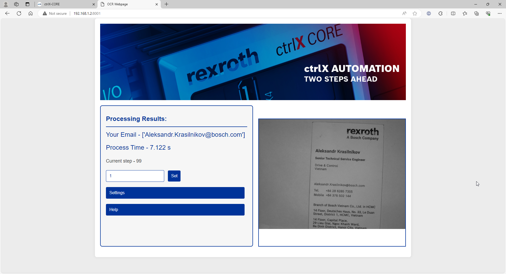

Hikrobot GigE camera and OCR snap for CtrlX Core

Version 01

Content

1\. General information 3

2\. Preparing Hikrobot libraries 5

3\. Python libraries 7

4\. Building project 7

5\. Overall explanation 9

# 1. General information

In the following document we show you how to create a snap for CtrlX Core to connect Hikrobot industrial GigE cameras and make a simple OCR detection with further data exchange via Modbus TCP server.

Versions used

All the functions and screenshots are based on:

-   CtrlX WORKS version 2.2.1
-   CtrlX Core X3
-   Runtime / Image version of CtrlX Core 2.4.1
-   Raspberri pi 4b with Ubuntu 22.04
-   VS Code

Prerequisites

In this snap we are using python libraries, such as OpenCV, pytesseract, Regex, pyModbusTCP, flask and their dependencies.

**Please beware**, since some of python libraries, such as numpy and wheel cannot be cross built, we need to use a device with the same architecture as your target device: CtrlX Core X3 – arm64, CtrlX Core X5/X7/Virtual – amd64. The other option is using “snapcraft remote-build”:

<https://boschrexroth.github.io/ctrlx-automation-sdk/remote-build.html>

For storing image on the CtrlX Core and web interface creation we are using same approach as in the example “Active configuration” which is accessible by this link:

<https://developer.community.boschrexroth.com/t5/Store-and-How-to/Create-and-delete-files-and-folders-in-Active-configuration/ba-p/71698>

Installing CtrlX AUTOMATION SDK:

<https://boschrexroth.github.io/ctrlx-automation-sdk/quick-start-guide.html>

Using App Build Environment (if using windows PC and remote build):

<https://www.youtube.com/watch?v=9f7_FId2PK4>

Other useful information can be checked in:

1.  Collection of how to:

<https://developer.community.boschrexroth.com/t5/Store-and-How-to/Collection-of-how-to-videos-blogs-and-examples-for-ctrlX/ba-p/12343>

1.  CtrlX AUTOMATION Forum:

<https://developer.community.boschrexroth.com/t5/Forum-ctrlX-AUTOMATION/ct-p/dcdev_community-bunit-dcae/?page=1&size=25&sort=latest-topics&filter=none&search=&mymessages=>

1.  Snapcraft documentation:

<https://snapcraft.io/docs>

Source code available on github page:

<https://github.com/AKRA-off/Hikrobot-camera-snap-with-OCR-for-CtrlX-Core/tree/main/ocr.hikrobot>

Hikrobot libraries required for building snap:

[opt.tar](https://bosch-my.sharepoint.com/:u:/r/personal/kra7spb_bosch_com/Documents/Share/CtrlX%20Core%20Hikrobot%20snap/opt.tar?csf=1&web=1&e=S0sXEu)

Ready to use snap:

[ocr-hikrobot_1.0.0_arm64.snap](https://bosch-my.sharepoint.com/:u:/r/personal/kra7spb_bosch_com/Documents/Share/CtrlX%20Core%20Hikrobot%20snap/ocr-hikrobot_1.0.0_arm64.snap?csf=1&web=1&e=FeDChO)

Copyright

© Bosch Rexroth AG 2024

All rights reserved, also regarding any disposal, exploitation, reproduction,

editing, distribution, as well as in the event of applications for industrial

property rights.

Liability

The specified data is intended for product description purposes only and shall not be deemed to be a guaranteed characteristic unless expressly stipulated in the contract. All rights are reserved with respect to the content of this documentation and the availability of the product.

Editorial Department

DCAZ/SLF2-VN [Akra]

# 2. Preparing Hikrobot libraries

As a first step, assuming that your environment is already prepared for making a snap we download Hikrobot MVS software: https://www.hikrobotics.com/en/machinevision/service/download

Inside the archive we can see libraries for our architecture arm64 “MVS-2.1.2_aarch64_20231116.tar.gz”. When you install it using ./setup.sh script in the root folder, all required “tar” archives are unpacked, but we don’t want to use SSH root access to our Ctrlx device, we would have to unpack and prepare all the files inside this archive manually and pack it again (you can use prepared .tar file from the link in prerequisites ). Configure environmental variables in **snapcraft.yaml**. Specifically we add code below to the “**LD_library_path**” on the **apps** **client environment** section:

**\$SNAP/usr/lib/python3.10/dist-packages:\$SNAP/opt/MVS/bin:\$SNAP/opt/MVS/lib/aarch64:\$SNAP/opt/MVS/lib/aarch64:\$SNAP/opt/MVS/lib/aarch64**

Other dependencies that we are adding manually:

**MVCAM_SDK_PATH: \$SNAP/opt/MVS**

**MVCAM_COMMON_RUNENV: \$SNAP/opt/MVS/lib/**

**MVCAM_MVS_LIBENV: \$SNAP/opt/MVS/lib/**

**MVCAM_GENICAM_CLPROTOCOL: \$SNAP/opt/MVS/lib/CLProtocol**

Next important step is to include prepared “tar” archive in our snap, in order to achieve that, we are adding code in our parts section of .yaml. Change the path to the source .tar file in your system:

**pylondeb:**

**plugin: dump**

**source: /home/boschrexroth/boschrexroth/SDK/ctrlx-automation-sdk-2.4.3/ctrlx-automation-sdk/CUSTOM/Hik/opt.tar**

**source-type: tar**

**organize:**

**'\*': opt/**

To get our Hikrobot ready to use in our code is adding Camera control import files to the project, we can take them from the archive we’ve downloaded in the start of this chapter located here: MVS\\Samples\\aarch64\\Python\\MvImport and create folder containing it to our project root folder:

Don’t forget to add our new module packages in “setup.py” file:

**packages=["MVImport", "dependencies"],**

## 3. Python libraries

As mentioned before, we are using OpenCV, pytesseract, Regex, pyModbusTCP, flask libraries and their dependencies, after we added everything in stage, python and build packages of the parts section of snapcraft.yaml, we have to configure package-repositories to use the latest version of tesseract (if we skip this, snap will install only version 4)

**package-repositories:**

**- type: apt**

**ppa: alex-p/tesseract-ocr5**

And add the line to **apps client environment** section (5/tessdata or 4.00/tessdata depending on the version you will use):

**TESSDATA_PREFIX: \$SNAP/usr/share/tesseract-ocr/5/tessdata/**

Some libraries like ctrlx_datalayer are added, but not used in current app version.

## 4. Building project

Open with VS Code the project folder “ocr.hikrobot” downloaded from the github link in prerequisites:

Before building the project, do not forget to make your set_env_path.sh script executable, to do that, you need to right click on configs folder and press “Open in integrated Terminal”:

Then use command:

**chmod +x set_env_path.sh**

Build your snap accessing “Run Build Task” from the “Terminal” tab and selecting build script for the corresponding architecture if you use native device with preinstalled Ubuntu. Or open new terminal and use “snapcraft remote-build” command described in prerequisites link:

As the result of the build, your snap file will appear in project folder:

## 5. Overall explanation.

1\. Python program **“main.py”** is located in the root project folder, it creates - Flask webserver used to connect to camera as well as take, process and display the image.

\- Program code to connect to the Hikrobot camera, take the image, process image quality and size, convert detected text to string with tesseract and extract data from the string via preset Regex rule.

\- Modbus TCP server to send the string.

2\. “**Dependencies”** folder with our webpage and static header image used by Flask webserver from **“main.py”.**

3\. Shell script **“set_env_path.sh”** to create a folder for storing the image taken with camera.

4\. **“active.package-manifest.json”** to create a sidebar in CtrlX Core for our app.

4\. Folder **“MVImport”** containing imports for camera control.

CtrlX Core Menu with installed app:

Webpage:

